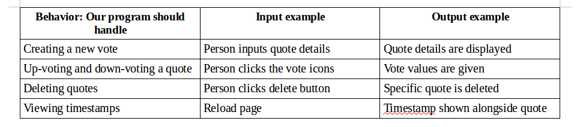

# Quotes

This is a web application that lets a person submit a quote and the author of that quote.
A person can also upvote, downvote or delete that quote

## Author Information
Written by *Duncan Chege*. His first attempt at using AngularJS in a web app.

## Installation

1. On GitHub, navigate to the main page of the repository.
2. Under the repository name, click Clone or download.
3. In the Clone with HTTPs section, click to copy the clone URL for the repository.
4. Open Terminal.
5. Change the current working directory to the location where you want the cloned directory to be made.
6. Type `git clone`, and then paste the URL you copied in Step 2.
7. Press Enter. Now your local clone will be created.

## Behaviour Driven Development

Below shows an image identifying different function executions

## Link to live site.
Click [here](https://dunyung1.github.io/quotes/) to view the webpage.

### Contact Information

To reach me, email me at: > dshege4@gmail.com

### License

-This project is licensed under the terms of the [MIT license](https://github.com/dunyung1/Web-work/blob/master/MIT%20License)
